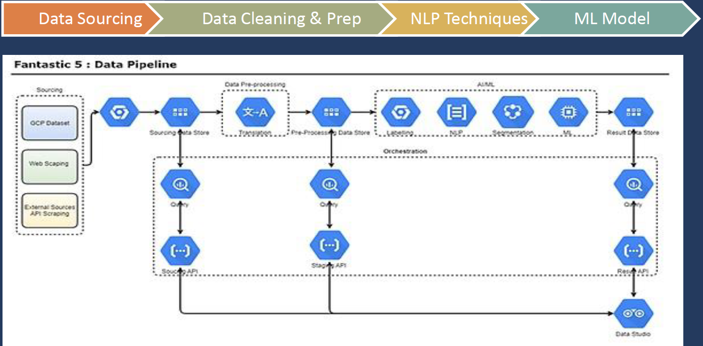

# Generate potential HNI clients for private banking and wealth management
This was a team project for the FoB Hackathon 2020, ML Challenge. We were a group of 5.

## The Use Case
- Create an AI/ML based platform to enable identification of potential prospects for Wealth Management leveraging News & Social Analytics.
- Using NLP & Clustering Techniques to identify topic of interests for a group of prospects
- Profiling the prospects using Publicly Available Social Media Data.
- Identify the Degree of Affinity of the prospects to the Trends.

## Demo application - https://datastudio.google.com/s/qRyMPSH5YFQ

## The ML Motivation
- Utilize the affluence of data & soaring social footprints of wealth creators, machine learning can be the motive force to gauge Social, Cognitive, Behavioural & Cultural elements of individuals who could be our future prospects.
- Drastically reduce the manual task of identification, analysis, profiling and segmentation of the leads generated.

## The Data Strategy
- Global Knowledge Graph (GKG): Starting point to filter data as per time series, countries, themes, etc eventually
- Data Segmentation: Confirm data metrics, data scale-up and segment variable definition. followed by Profiling and interpretation.
- Profiling: Building a profile map and perform social and news analytics
- Network Graph: Networkx – Network Cascading Algorithm to simulate link associations in the network graph of prospects that have a social or business connection and a potential lead.
- LinkedIn, Wikipedia, Twitter and Instagram were used for profiling and key value extraction. 

## The ML Model
- NLP : Stop Word Removal, Tokenisation, Stemming, Lemmatisation, N-Gram Modelling, TF-IDF to find out high frequency n-grams
- Latent Dirichlet Allocation (LDA): Generative statistical model that allowed us to use sets of observations in order to explain similar parts of data by unobserved groups thus facilitating Topic Modelling.

## The Pipeline

A loooot more could have ben done. Some half baked ideas of ours are [here](/Documents/FoB%20Workspace%20-%20Fantastic%205.xlsx)
 [Inspiration](https://databricks.com/notebooks/esg_notebooks/01_esg_report.html) for LDA topic modelling. See Stages 1-3.
https://github.com/mukut03/ESG-BERT
